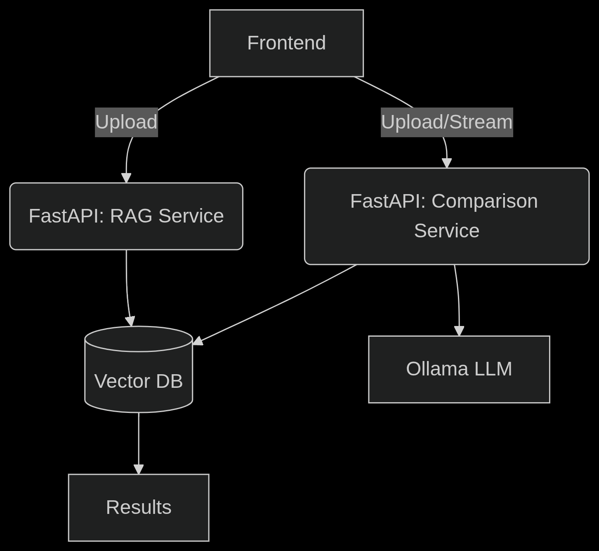
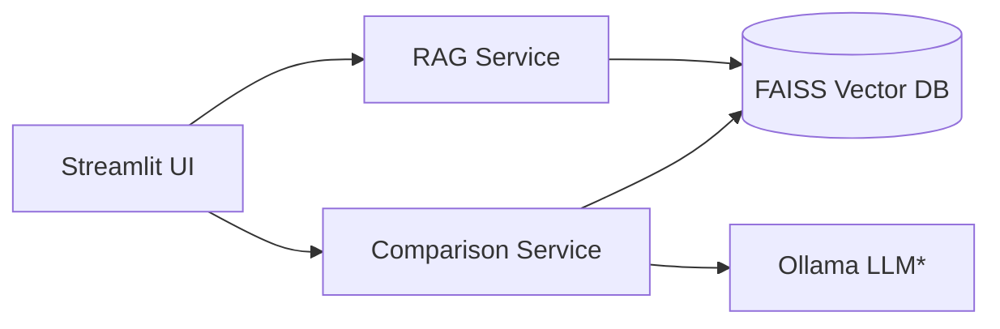

# Acoustic Vigilance System 🎵

A Dockerized microservice application for machine sound analysis, comparing test audio against reference sounds using TinyWav2Vec2 embeddings and FAISS/Chroma similarity search.

## **Features**

- 📁 **RAG Service**: Upload reference machine sounds (e.g., "good condition" recordings)

- 🔍 **Comparison Service**: Test short audio clips against references

- 💬 **Streamlit Chat**: Interactive UI for sound uploads and diagnostics

- 🐳 **Dockerized**: Ready for local development or deployment

## **System Architecture**






## **Optional for text diagnostics_**


## **Prerequisites**


- Docker 20.10+

- Docker Compose 2.20+

- (Optional) NVIDIA Container Toolkit for GPU acceleration


## **Quick Start**


1. Clone the repository:


```bash

git clone https://github.com/your-repo/acoustic-vigilance.git

cd acoustic-vigilance

```


2. Configure environment (edit `.env` if needed):


```bash

cp .env.example .env

```


3. Start services:


```bash

docker-compose up --build

```


4. Access services:

- Streamlit UI: <http://localhost:8501>

- RAG API: <http://localhost:8000/docs>

- Comparison API: <http://localhost:8001/docs>


## **Services Overview**


| Service | Port | Description |

|---------|------|-------------|

| `rag_service` | 8000 | Handles reference sound uploads and embedding generation |

| `comparison_service` | 8001 | Compares test audio against references |

| `chat_service` | 8501 | Streamlit web interface |

| `ollama` | 11434 | (Optional) LLM for text diagnostics |


## **Environment Variables (`.env`)**


```ini

# Model Configuration

EMBEDDING_MODEL=facebook/wav2vec2-tiny

SIMILARITY_THRESHOLD=0.7


# Audio Processing

SAMPLE_RATE=16000

CHUNK_SIZE_SECONDS=30


# Ollama (Optional)

OLLAMA_MODEL=tinyllama

```


## **Usage Examples [currently support .wav you can add ffmpeg of similar lib to make for mp3 or so]**


1. **Upload a reference sound** (via Streamlit or API):


```bash

curl -X POST -F "file=@good_machine.wav" http://localhost:8000/upload_rag

```


2. **Test a machine sound**:


```bash

curl -X POST -F "file=@suspect_machine.wav" http://localhost:8001/compare

```


## **Development**


- **Rebuild a single service**:


```bash

docker-compose up --build rag_service

```


- **View logs**:


```bash

docker-compose logs -f comparison_service

```


## **License**


MIT


## **.env**


```ini

# ======================

# ACOUSTIC VIGILANCE

# ======================


# ----- Model Settings -----

EMBEDDING_MODEL=facebook/wav2vec2-tiny

SIMILARITY_THRESHOLD=0.7 # Healthy if > threshold


# ----- Audio Processing -----

SAMPLE_RATE=16000 # Hz

CHUNK_SIZE_SECONDS=30 # Split audio into N-second chunks


# ----- Ollama (Optional) -----

OLLAMA_ENABLED=false

OLLAMA_MODEL=tinyllama


# ----- Storage Paths -----

RAG_STORAGE_PATH=/app/storage/rag_audio

TEST_STORAGE_PATH=/app/storage/test_audio


# ----- Performance -----

MAX_FILE_SIZE_MB=50 # Reject larger uploads

```


---


### **Key Notes**


1. **Model Flexibility**:

- Change `EMBEDDING_MODEL` to `google/trill-distilled` for mobile-ready models

- Adjust `SIMILARITY_THRESHOLD` based on your validation data


2. **Security**:


- For production, add these to `.env`:


```ini

API_KEY=your_secret_key

CORS_ORIGINS=http://localhost:8501

```


3. **Ollama Integration**:

- Set `OLLAMA_ENABLED=true` to enable LLM diagnostics

- Requires `ollama pull tinyllama` before startup
